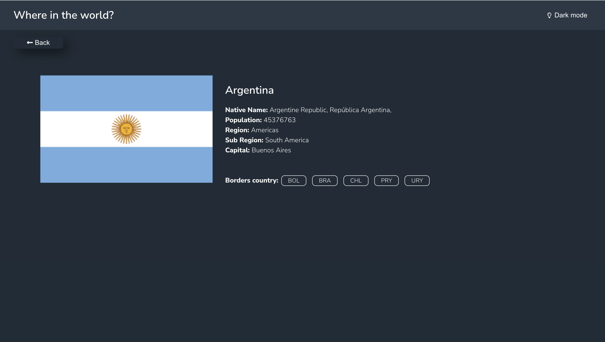
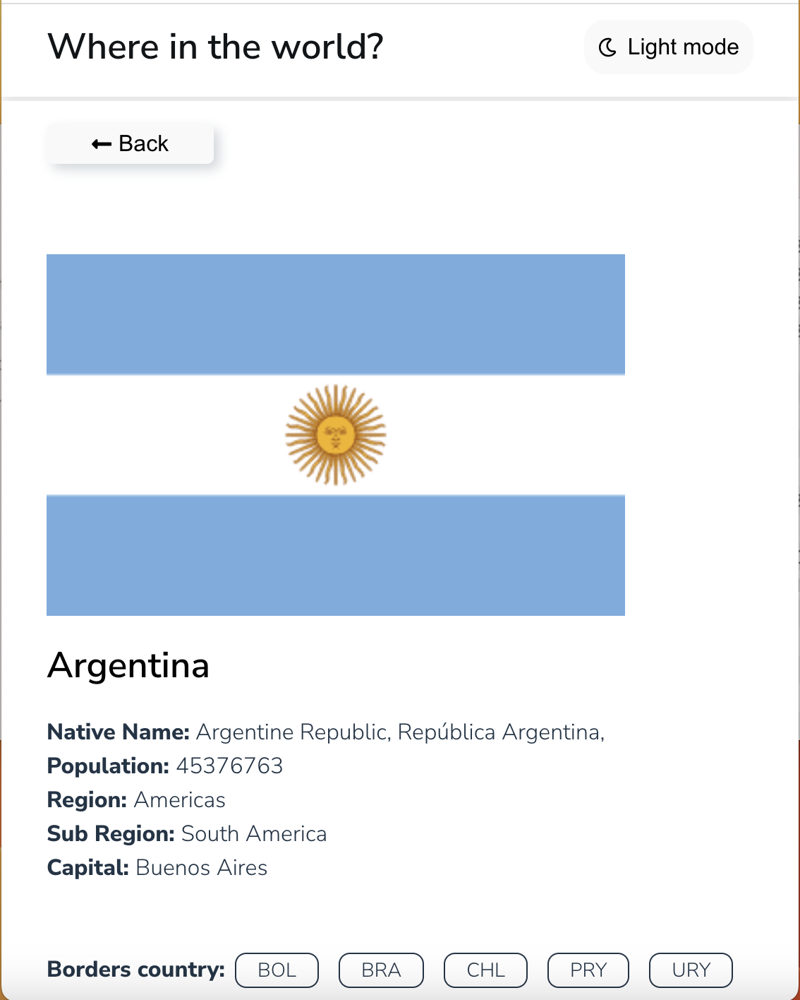

# Frontend Mentor - REST Countries API with color theme switcher solution

This is a solution to the [REST Countries API with color theme switcher challenge on Frontend Mentor](https://www.frontendmentor.io/challenges/rest-countries-api-with-color-theme-switcher-5cacc469fec04111f7b848ca). Frontend Mentor challenges help you improve your coding skills by building realistic projects. 

## Table of contents

- [Overview](#overview)
  - [The challenge](#the-challenge)
  - [Screenshot](#screenshot)
  - [Links](#links)
- [My process](#my-process)
  - [Built with](#built-with)
  - [What I learned](#what-i-learned)
  - [Continued development](#continued-development)
  - [Useful resources](#useful-resources)
- [Author](#author)
- [Got feedback for us](#Got-feedback-for-us)

**Note: Delete this note and update the table of contents based on what sections you keep.**

## Overview

### The challenge

Users should be able to:

- See all countries from the API on the homepage
- Search for a country using an `input` field
- Filter countries by region
- Click on a country to see more detailed information on a separate page
- Click through to the border countries on the detail page
- Toggle the color scheme between light and dark mode *(optional)*

### Screenshot

Add a screenshot of your solution. The easiest way to do this is to use Firefox to view your project, right-click the page and select "Take a Screenshot". You can choose either a full-height screenshot or a cropped one based on how long the page is. If it's very long, it might be best to crop it.

### Links

- Solution URL: [Add solution URL here](https://github.com/surushTodzhibekov/rest-countries-api-with-color-theme-switcher-master)
- Live Site URL: [Add live site URL here](https://effervescent-marzipan-535b7f.netlify.app/)

## My process

### Built with

- Semantic HTML5 markup
- CSS custom properties
- Flexbox
- CSS Grid
- Typescript
- Context
- [React](https://reactjs.org/) - JS library

### What I learned

Using states with React mixed with attaching an API.
Implementing dark mode.
Also how to get value of nested object

### Continued development

Use this section to outline areas that you want to continue focusing on in future projects. These could be concepts you're still not completely comfortable with or techniques you found useful that you want to refine and perfect.

**Note: Delete this note and the content within this section and replace with your own plans for continued development.**

### Useful resources

- [React useContext](https://legacy.reactjs.org/docs/context.html) - This helped me for setting dark mode in app.
- [Typescript](https://www.typescriptlang.org/) - This is helped me to review some types and implement it. I'd recommend it to anyone still checking documentation.

## Author

- Github - [Github](https://github.com/surushTodzhibekov)
- Frontend Mentor - [@surushTodzhibekov](https://www.frontendmentor.io/profile/surushTodzhibekov)
- Twitter - [@Amrobek](https://www.twitter.com/Amrobek)

## Got feedback for us?

We love receiving feedback! We're always looking to improve our challenges and our platform. So if you have anything you'd like to mention, please email hi[at]frontendmentor[dot]io.

This challenge is completely free. Please share it with anyone who will find it useful for practice.

**Have fun building!** 🚀
